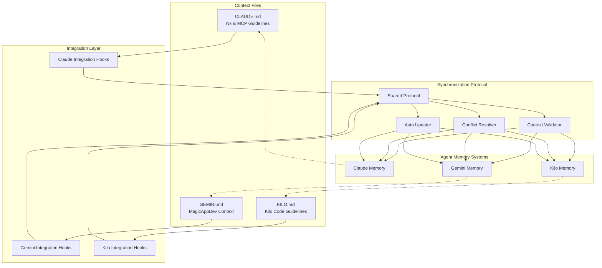

## Bidirectional Integration System Architecture

### Core Components

1. **Context Files**
   - **CLAUDE.md**: Contains Nx configuration guidelines and MCP server usage
   - **GEMINI.md**: Contains comprehensive MagicAppDev project context and development guidelines
   - **KILO.md**: Contains Kilo Code specific guidelines and mode-based workflows

2. **Integration Hooks**
   - **Call Mechanism Hooks**: Automatically import relevant context from other agents at the start of interactions
   - **End Prompt Hooks**: Update persistent memory with new learnings and cross-references
   - **File Change Triggers**: Automatic synchronization when any context file is modified

3. **Synchronization Protocol**
   - **Shared Protocol**: Standardized format for context exchange between agents
   - **Context Validator**: Ensures imported context is relevant and non-conflicting
   - **Conflict Resolver**: Handles overlapping or contradictory information
   - **Auto Updater**: Monitors file changes and triggers synchronization

4. **Agent Memory Systems**
   - **Persistent Memory**: Each agent maintains its own memory with cross-referenced knowledge
   - **Bidirectional Updates**: Changes in one agent's context can propagate to others
   - **Context Awareness**: Agents know when they're using information from another agent

### Integration Flow

1. **Initialization**: Each agent loads its primary context file plus integration hooks
2. **Call Trigger**: When an agent is invoked, hooks automatically import relevant context from other agents
3. **Interaction**: Agent uses combined context from all sources for enhanced responses
4. **Memory Update**: At end of interaction, agent updates its persistent memory and cross-references
5. **Synchronization**: File changes trigger automatic updates across all agents

### Key Features

- **Persistent Cross-References**: Agents remember which information came from which source
- **Conflict Resolution**: Automatic detection and resolution of conflicting information
- **Context Relevance**: Smart filtering ensures only relevant context is imported
- **Real-time Synchronization**: Changes propagate immediately across all agents
- **Maintenance Transparency**: Clear documentation of integration points and update procedures
