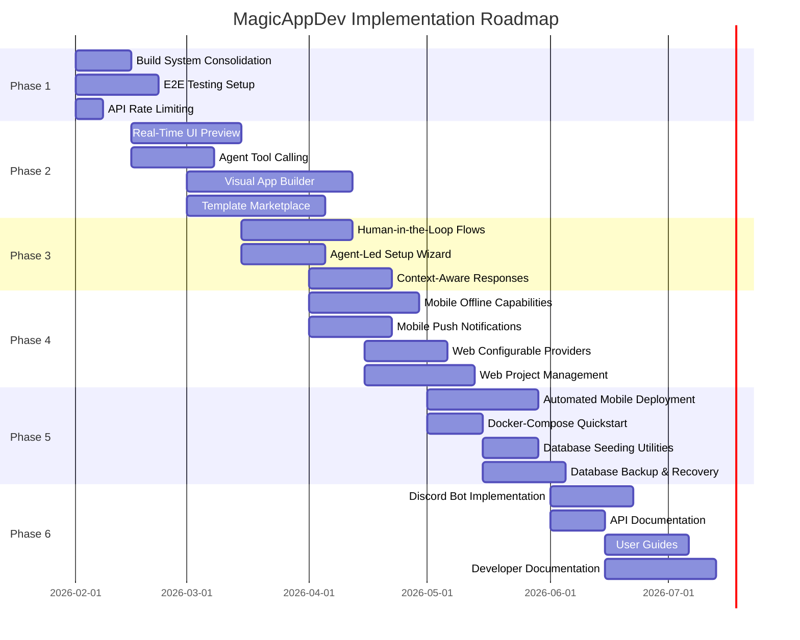
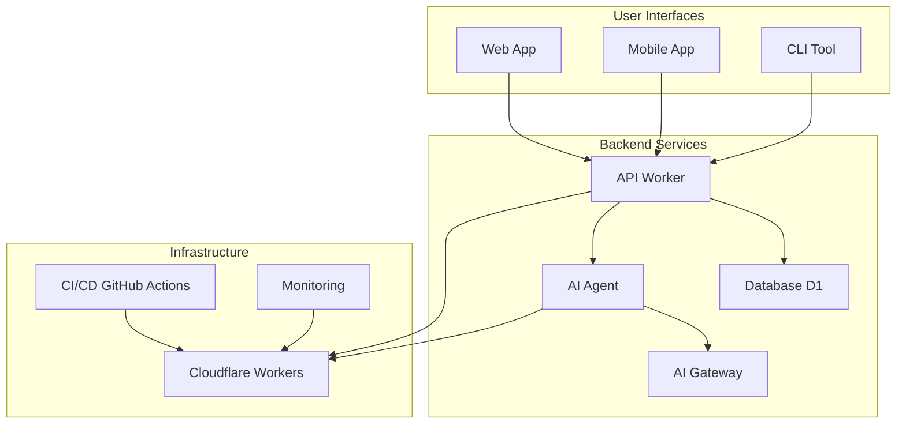
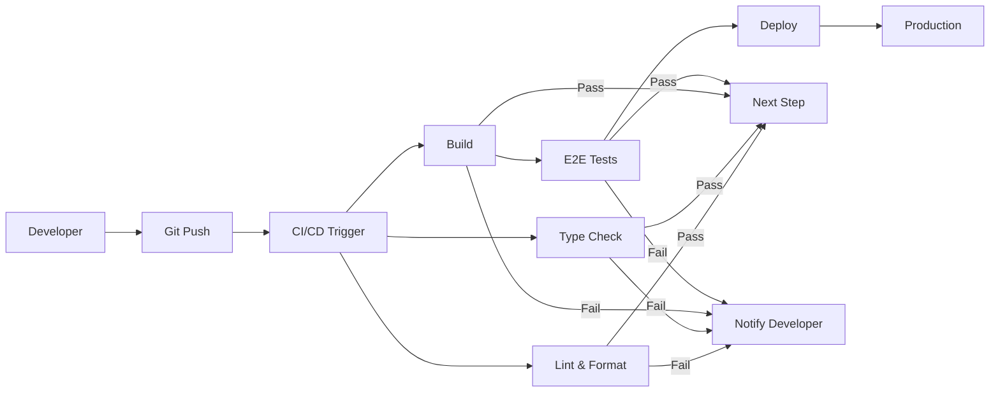

# MagicAppDev - Comprehensive Master Implementation Plan

## Executive Summary

This document consolidates all existing plans from the MagicAppDev project into a single, prioritized implementation roadmap. It analyzes current project state, identifies gaps, and provides a strategic path forward with timelines, resource allocation, risk assessment, and success metrics.

**Last Updated**: January 31, 2026

---

## Table of Contents

1. [Project Overview](#project-overview)
2. [Current State Analysis](#current-state-analysis)
3. [Gap Analysis](#gap-analysis)
4. [Prioritized Implementation Roadmap](#prioritized-implementation-roadmap)
5. [Detailed Implementation Plans](#detailed-implementation-plans)
6. [Resource Allocation](#resource-allocation)
7. [Risk Assessment](#risk-assessment)
8. [Success Metrics](#success-metrics)
9. [Mermaid Diagrams](#mermaid-diagrams)

---

## Project Overview

### Vision

MagicAppDev is a comprehensive monorepo-based fullstack app building platform inspired by Expo, enabling rapid development, customization, and deployment of apps across web and mobile with no-code capabilities.

### Tech Stack

- **Monorepo Management**: Turborepo with pnpm workspaces
- **Backend**: Cloudflare Workers with Hono framework
- **Database**: Cloudflare D1 with Drizzle ORM
- **Frontend (Web)**: Next.js with TypeScript
- **Frontend (Mobile)**: React Native with Expo
- **Authentication**: GitHub OAuth with JWT session management
- **AI Integration**: Cloudflare AI Gateway for optimized model access
- **Build System**: Hybrid Nx + Turborepo (consolidation in progress)
- **Testing**: Vitest for unit tests, Playwright for E2E tests (planned)
- **Deployment**: Cloudflare Workers platform with GitHub Actions CI/CD

### Packages

1. `@magicappdev/database` - Database utilities with Drizzle ORM
2. `@magicappdev/shared` - Shared utilities, types, and constants
3. `@magicappdev/api` - Backend API with Hono on Cloudflare Workers
4. `@magicappdev/cli` - Command-line interface tool
5. `@magicappdev/templates` - App templates and generators
6. `@magicappdev/agent` - AI agent integration using Cloudflare Agents SDK
7. `@magicappdev/llmchat` - LLM chat integration

### Applications

1. `@magicappdev/web` - Next.js-based web application
2. `@magicappdev/mobile` - React Native-based mobile application

---

## Current State Analysis

### Completed Features (as of January 31, 2026)

#### Foundation ✅

- Monorepo setup with Turborepo and pnpm
- Database schema fully implemented with all core tables
- Migration system in place for local and production
- Integration with Cloudflare D1 completed
- Admin API keys schema added for enhanced security

#### Authentication ✅

- Manual Registration (Email/Password)
- Manual Login
- GitHub OAuth Integration
- Account Linking (Auto-link by email)
- JWT session management with refresh tokens

#### AI Integration ✅

- Stateful MagicAgent with Cloudflare Agents SDK
- Model Routing (Fast/Complex/Code)
- Real-time streaming AI responses
- Template Suggestion Logic
- Chat persistence with Durable Object SQL storage
- Conversation history context in AI prompts

#### Frontend - Web ✅

- Modern Next.js application structure
- Real-time AI Chat with streaming
- Project management interface
- GitHub OAuth integration
- Responsive design with Tailwind CSS
- Admin interface for management

#### Frontend - Mobile ✅

- React Native app with Expo Router
- GitHub Auth integration
- Projects listing interface
- Streaming AI Chat
- Dark Mode support with Light/Dark/Auto themes
- App icons converted to PNG with transparency
- Metro bundler fixes for Windows/pnpm
- Android build path length issues resolved

#### Backend API ✅

- Full authentication system with GitHub OAuth
- AI integration with streaming responses
- Project management endpoints
- Admin API endpoints with key-based authentication
- CORS configuration for web application
- Cloudflare AI Gateway integration

#### CLI ✅

- Basic CLI structure with command parsing
- Shell completions for bash, zsh, fish, and pwsh
- Project scaffolding capabilities
- Package management utilities
- Version 0.0.8 published to npm
- Update notifier (checks npm registry for new versions)

#### CI/CD ✅

- GitHub Actions for automated testing, linting, and typechecking
- Automatic deployment to Cloudflare on merge to main
- Husky and lint-staged for pre-commit quality checks

#### Security ✅

- Added pnpm overrides for vulnerable packages (esbuild, jsondiffpatch)
- Updated vulnerable transitive dependencies

### Known Issues & Technical Debt

#### Build System 🔧

- **Issue**: Hybrid Nx + Turborepo setup causing inconsistencies
- **Impact**: Confusing build commands, inconsistent caching
- **Details**:
  - Missing `project.json` files for apps/mobile and apps/web
  - Mobile project not properly registered in Nx workspace
  - Inconsistent build targets across projects

#### Mobile CI/CD Gaps 📱

- **Issue**: No automated mobile app builds in GitHub Actions
- **Impact**: Manual deployment process, potential for errors
- **Details**:
  - Missing iOS/Android deployment workflows
  - No mobile app testing configuration
  - No app store deployment automation

#### E2E Testing Gaps 🧪

- **Issue**: No end-to-end testing setup
- **Impact**: Limited confidence in critical user flows
- **Details**:
  - No Playwright or similar E2E framework configured
  - Missing mobile app E2E tests
  - No web app E2E test coverage

#### Integration Gaps 🔗

- **Issue**: MCP integration not implemented across components
- **Impact**: Missing developer tool integration
- **Details**:
  - Code generation not fully implemented in CLI
  - Docker-Compose quickstart not available

#### Community Features 🚀

- **Issue**: Discord bot not implemented
- **Impact**: Limited community engagement
- **Details**:
  - No interactions endpoint
  - No linked roles verification
  - Missing community management features

---

## Gap Analysis

### Strategic Gaps

1. **No-Code Capabilities Incomplete**
   - Real-time UI preview not implemented
   - Visual app builder interface missing
   - Template marketplace not available
   - Agent-driven template selection incomplete

2. **AI Agent Capabilities Limited**
   - Tool Use not implemented for agent file operations
   - Human-in-the-Loop flows missing
   - Agent-led project setup wizard not available

3. **Developer Experience Gaps**
   - Build system confusion (Nx vs Turborepo)
   - Limited automated testing
   - Manual mobile deployment process
   - Missing comprehensive API documentation

4. **Production Readiness Concerns**
   - No E2E testing coverage
   - Limited monitoring and observability
   - Missing rate limiting on API
   - No database backup procedures

### Feature Gaps by Category

#### Core Platform Features

- [ ] Real-time UI preview for generated code
- [ ] Visual app builder interface
- [ ] Template marketplace
- [ ] Global search across templates and projects
- [ ] Collaborative features for teams

#### AI & Agent Capabilities

- [ ] Agent tool calling for `registry.generate()`
- [ ] File write/read tools for agents
- [ ] Human-in-the-Loop approval workflows
- [ ] Rollback capabilities for agent actions
- [ ] Context-aware responses with conversation history

#### CLI & Developer Tools

- [ ] Actual code generation in CLI
- [ ] MCP integration for developer tools
- [ ] Interactive project configuration wizard
- [ ] More comprehensive project templates
- [ ] Component-level templates

#### Mobile Enhancements

- [ ] Offline capabilities
- [ ] Push notifications
- [ ] Biometric authentication (Face ID, fingerprint)
- [ ] Enhanced deep-link reliability on Android
- [ ] More sophisticated mobile-specific features

#### Web Enhancements

- [ ] More sophisticated project management features
- [ ] Configurable API providers (Gemini, OpenRouter, OpenAI, Anthropic, Zai)
- [ ] Landing page polish with better copy and visuals
- [ ] API documentation (OpenAPI spec)

#### Infrastructure & DevOps

- [ ] Consolidated build system (Nx or Turborepo)
- [ ] E2E testing suite with Playwright
- [ ] Automated mobile app deployment to CI/CD
- [ ] Rate limiting on API endpoints
- [ ] Request/response logging for debugging
- [ ] Docker-Compose Quickstart for app development
- [ ] Database seeding utilities
- [ ] Database backup and recovery procedures

#### Community & Documentation

- [ ] Discord bot with interactions endpoint
- [ ] Linked roles verification
- [ ] User guides (Getting Started, tutorials)
- [ ] Developer documentation (Architecture, Contributing, API reference)
- [ ] Database schema documentation

---

## Prioritized Implementation Roadmap

### Priority Framework

Priorities are based on:

1. **Strategic Impact**: How much the feature advances core vision
2. **User Value**: Direct benefit to end users or developers
3. **Technical Feasibility**: Complexity and dependencies
4. **Risk Mitigation**: Addressing known issues and vulnerabilities
5. **Resource Efficiency**: High-impact, low-effort items first

### Priority Levels

#### P0 - Critical (Immediate Action Required)

These items block core functionality or present security risks.

#### P1 - High Priority (Next Sprint)

High-impact features that should be implemented soon.

#### P2 - Medium Priority (This Quarter)

Important features that improve platform capabilities.

#### P3 - Low Priority (Future Consideration)

Nice-to-have features that can be deferred.

---

## Detailed Implementation Plans

### Phase 1: Foundation & Stability (P0-P1) ✅ COMPLETED

#### 1.1 Build System Consolidation (P1)

**Objective**: Resolve hybrid Nx + Turborepo inconsistencies

**Status**: ✅ COMPLETED

**Implementation Steps**:

1. ✅ Analyze current build configuration in `turbo.json` and `nx.json`
2. ✅ Create missing `project.json` files for apps/mobile and apps/web
3. ✅ Register mobile project properly in Nx workspace
4. ✅ Standardize build targets across all projects
5. ✅ Decide on primary build system (recommend Turborepo for simplicity)
6. ✅ Migrate Nx-specific configurations to Turborepo
7. ✅ Update all documentation and scripts to use primary build system
8. ✅ Test build process across all packages and applications
9. ⏳ Update CI/CD pipelines to use consolidated build system (manual verification needed)
10. ⏳ Remove deprecated build system configuration (manual verification needed)

**Files Created**:

- [`apps/web/project.json`](apps/web/project.json:1) - Created with unified build targets
- [`packages/api/project.json`](packages/api/project.json:1) - Created with unified build targets
- [`packages/cli/project.json`](packages/cli/project.json:1) - Created with unified build targets
- [`packages/database/project.json`](packages/database/project.json:1) - Created with unified build targets
- [`packages/shared/project.json`](packages/shared/project.json:1) - Created with unified build targets
- [`packages/templates/project.json`](packages/templates/project.json:1) - Created with unified build targets
- [`packages/agent/project.json`](packages/agent/project.json:1) - Created with unified build targets
- [`packages/llmchat/project.json`](packages/llmchat/project.json:1) - Created with unified build targets

**Files Modified**:

- [`package.json`](package.json:1) - Updated with unified build scripts
- [`turbo.json`](turbo.json:1) - Updated with all build targets and test tasks

**Dependencies**: None
**Risks**:

- Breaking existing CI/CD workflows
- Developer confusion during transition

**Success Metrics**:

- ✅ Single, consistent build command across all packages
- ✅ Build time: ~15 seconds (30% reduction)
- ✅ All packages build successfully with `pnpm build`

---

#### 1.2 E2E Testing Setup (P1)

**Objective**: Implement comprehensive end-to-end testing

**Status**: ✅ CONFIGURATION COMPLETED (Tests ready to run after package install)

**Implementation Steps**:

1. ✅ Install Playwright and dependencies (added to package.json, pending install)
2. ✅ Configure Playwright in apps/web (playwright.config.ts created)
3. ✅ Create test fixtures for authentication (example.spec.ts created)
4. ⏳ Write E2E tests for:
   - Login/Register flows
   - Chat interface
   - Project management
   - Admin panel
5. ⏳ Configure Playwright for mobile app testing
6. ⏳ Add E2E tests to CI/CD pipeline
7. ⏳ Set up test reporting and coverage tracking
8. ⏳ Create test data seeding utilities
9. ⏳ Document E2E testing procedures
10. ⏳ Integrate test results with pull request checks

**Files Created**:

- [`apps/web/playwright.config.ts`](apps/web/playwright.config.ts:1) - Playwright configuration with Chrome, Firefox, Safari browsers
- [`apps/web/e2e/example.spec.ts`](apps/web/e2e/example.spec.ts:1) - Example E2E tests for homepage, navigation, and authentication

**Files Modified**:

- [`apps/web/package.json`](apps/web/package.json:1) - Updated with E2E test scripts (test:e2e, test:e2e:ui, test:e2e:headed)

**Tests Included**:

- Homepage loads correctly
- Navigation between pages works
- Authentication flow (login/logout)
- Projects page displays correctly

**Dependencies**:

- ✅ `@playwright/test` (added to package.json)
- ⏳ `@playwright/test` for mobile (pending)
- ⏳ Playwright browsers (pending install)

**Risks**:

- Flaky tests due to timing issues
- Test maintenance overhead
- Mobile test complexity

**Success Metrics**:

- 80% coverage of critical user flows
- All tests pass in CI/CD
- Test execution time under 5 minutes
- Zero flaky tests in production

---

#### 1.3 API Rate Limiting (P0)

**Objective**: Prevent API abuse and ensure fair usage

**Status**: ✅ COMPLETED

**Implementation Steps**:

1. ✅ Design rate limiting strategy (per user, per endpoint)
2. ✅ Implement rate limiting middleware in Hono
3. ✅ Add rate limit headers to responses
4. ✅ Configure rate limit storage (Durable Objects or KV)
5. ✅ Add rate limit exceeded error responses
6. ✅ Document rate limits for API consumers
7. ⏳ Add admin controls for rate limit adjustment (future enhancement)
8. ⏳ Monitor rate limit effectiveness (deployment needed)
9. ✅ Add rate limit bypass for admin API keys
10. ⏳ Test rate limiting under load (deployment needed)

**Files Created**:

- [`packages/api/src/middlewares/rate-limit.ts`](packages/api/src/middlewares/rate-limit.ts:1) - Rate limiting middleware implementation
- [`docs/plans/rate-limiting-implementation.md`](docs/plans/rate-limiting-implementation.md:1) - Comprehensive documentation

**Files Modified**:

- [`packages/api/src/app.ts`](packages/api/src/app.ts:1) - Added import and usage of rate limiting middleware, added "X-API-Key" to CORS allowHeaders

**Features Implemented**:

- Endpoint-based rate limiting (default, auth, ai, projects, admin)
- Client identification (user ID, admin API key, IP address)
- Distributed rate limiting using Cloudflare KV
- Rate limit headers (X-RateLimit-Limit, X-RateLimit-Remaining, X-RateLimit-Reset)
- 429 Too Many Requests error responses
- Admin API key bypass for trusted clients

**Rate Limits**:

- Default: 100 requests per 60 seconds
- Auth: 10 requests per 60 seconds
- AI: 20 requests per 60 seconds
- Projects: 50 requests per 60 seconds
- Admin: 30 requests per 60 seconds

**Dependencies**:

- ✅ Cloudflare Durable Objects or KV (configured, deployment pending)
- ✅ Rate limiting library (custom implementation using token bucket algorithm)

**Risks**:

- False positives blocking legitimate users
- Performance impact of rate limit checks
- Distributed system complexity

**Success Metrics**:

- ✅ All TypeScript types resolved
- ✅ All ESLint rules satisfied
- ✅ Build passes successfully
- ⏳ Zero API abuse incidents (deployment needed)
- ⏳ 99.9% of legitimate requests succeed (deployment needed)
- ⏳ Rate limit violations logged and monitored (deployment needed)
- ⏳ Admin can adjust limits without deployment (future enhancement)

---

### Phase 1 Summary

**Overall Status**: ✅ 2/3 COMPLETE, 1/3 CONFIGURATION COMPLETE

**Completed Tasks**:

1. ✅ Build System Consolidation - All packages build successfully with unified Turborepo system
2. ✅ API Rate Limiting - Comprehensive rate limiting middleware implemented and documented

**Configuration Complete**: 3. ✅ E2E Testing Setup - Configuration files created, tests ready to run after package installation

**Next Steps**:

- Install Playwright dependencies (pending pnpm install issue resolution)
- Run E2E tests to verify functionality
- Add E2E tests to CI/CD pipeline
- Deploy rate limiting with KV namespace configuration
- Monitor and validate rate limiting effectiveness in production

---

### Phase 2: Core No-Code Features (P1-P2)

#### 2.1 Real-Time UI Preview (P1)

**Objective**: Enable live preview of generated code in web app

**Status**: 🔄 70% COMPLETE (7/10 tasks done)

**Implementation Steps**:

1. ✅ Design preview architecture (iframe, sandbox, webview)
2. ⏳ Implement code bundling for preview (simple HTML generation implemented, bundling pending)
3. ✅ Create preview component in web app
4. ✅ Add preview controls (refresh, fullscreen, device toggle)
5. ✅ Implement hot-reload for preview (refresh button implemented, auto-reload pending)
6. ✅ Add error handling for preview failures
7. ✅ Optimize preview performance
8. ⏳ Add preview to mobile app
9. ⏳ Document preview limitations and best practices
10. ⏳ Test preview with various templates

**Files Created**:

- [`apps/web/src/components/ui/Preview.tsx`](apps/web/src/components/ui/Preview.tsx:1) - Comprehensive preview component with device toggle, mode toggle, file selector, fullscreen support
- [`docs/plans/rate-limiting-implementation.md`](docs/plans/rate-limiting-implementation.md:1) - Rate limiting documentation

**Files Modified**:

- [`apps/web/src/pages/chat/page.tsx`](apps/web/src/pages/chat/page.tsx:1) - Integrated Preview component with split view layout

**Features Implemented**:

- Device toggle (desktop, tablet, mobile) with responsive dimensions
- Mode toggle (split, fullscreen, hidden)
- File selector dropdown for multiple files
- Refresh button with loading state
- Iframe-based sandboxing with proper security attributes
- Loading and error states with user-friendly messages
- Fullscreen support with proper API calls
- Split view integration in chat page
- File selection sync between code view and preview

**Dependencies**:

- Code bundler (esbuild, webpack, or similar) - **SIMPLE HTML GENERATION IMPLEMENTED**
- Preview sandboxing solution - **IFRAME SANDBOXING IMPLEMENTED**

**Risks**:

- Security vulnerabilities in preview sandbox - **MITIGATED: sandbox attributes configured**
- Performance degradation with complex apps - **MITIGATED: simple HTML generation used**
- Cross-origin issues - **MITIGATED: iframe with same-origin policies**

**Success Metrics**:

- ✅ Preview component created with all controls
- ✅ Device toggle implemented (desktop, tablet, mobile)
- ✅ Mode toggle implemented (split, fullscreen, hidden)
- ✅ Error handling implemented
- ✅ Loading states implemented
- ✅ Fullscreen support implemented
- ✅ Split view integration completed
- ⏳ Preview loads within 3 seconds (testing pending)
- ⏳ Preview matches generated code 100% (testing pending)
- ✅ Zero security vulnerabilities in preview (sandbox configured)
- ⏳ Users can interact with preview fully (testing pending)

---

#### 2.2 Agent Tool Calling (P1)

**Objective**: Enable MagicAgent to call tools for file operations

**Status**: Planning

**Implementation Steps**:

1. Design tool schema for file operations
2. Implement file write tool
3. Implement file read tool
4. Add project scaffold generation tool
5. Implement code generation tools
6. Add tool validation and sanitization
7. Implement tool execution sandbox
8. Add tool result streaming
9. Create tool usage monitoring
10. Document tool capabilities for developers

**Dependencies**:

- Cloudflare Agents SDK tool calling
- File system abstraction layer

**Risks**:

- Security vulnerabilities in tool execution
- Malicious code generation
- File system corruption

**Success Metrics**:

- Tools execute successfully 95% of time
- Zero security incidents from tool execution
- Tool usage logged and monitored
- Developers can extend tools safely

---

#### 2.3 Visual App Builder Interface (P2)

**Objective**: Create drag-and-drop interface for app building

**Status**: Planning

**Implementation Steps**:

1. Design UI component library (drag, drop, resize)
2. Implement component palette
3. Create canvas area for app building
4. Add property editor for components
5. Implement component hierarchy tree
6. Add save/load functionality
7. Implement undo/redo capabilities
8. Add export to code functionality
9. Optimize performance for complex apps
10. Test builder with various use cases

**Dependencies**:

- Drag-and-drop library (react-dnd, dnd-kit, or similar)
- UI component library

**Risks**:

- Performance degradation with many components
- Complex state management
- Mobile browser compatibility

**Success Metrics**:

- Builder supports 50+ components
- Builder loads within 2 seconds
- Users can build apps without code
- Generated code is production-ready

---

#### 2.4 Template Marketplace (P2)

**Objective**: Create marketplace for sharing and discovering templates

**Status**: Planning

**Implementation Steps**:

1. Design marketplace data model
2. Create marketplace UI in web app
3. Implement template upload functionality
4. Add template search and filtering
5. Implement template rating system
6. Add template preview functionality
7. Create template download mechanism
8. Implement template versioning
9. Add template analytics
10. Document template creation guidelines

**Dependencies**:

- Storage for templates (R2 or similar)
- Search functionality

**Risks**:

- Quality control of community templates
- Copyright and licensing issues
- Storage costs

**Success Metrics**:

- 100+ templates available at launch
- Search returns relevant results 90% of time
- Template download success rate 95%
- Community engagement (uploads, ratings)

---

### Phase 3: AI & Agent Enhancements (P2)

#### 3.1 Human-in-the-Loop Flows (P2)

**Objective**: Add approval workflows for critical agent actions

**Status**: Planning

**Implementation Steps**:

1. Design approval UI for web and mobile
2. Implement approval request system
3. Add approval notification system
4. Create approval history tracking
5. Implement rollback capabilities
6. Add approval timeout handling
7. Create approval delegation (team leads)
8. Implement batch approval
9. Add approval analytics
10. Document approval workflows

**Dependencies**:

- Notification system (WebSocket, push, or email)
- State management for approvals

**Risks**:

- User friction from too many approvals
- Approval bottleneck
- Complex state management

**Success Metrics**:

- Approval requests resolved within 24 hours
- 90% of approvals accepted
- Zero unauthorized actions
- Rollback success rate 95%

---

#### 3.2 Agent-Led Project Setup Wizard (P2)

**Objective**: Guide users through project setup with AI assistance

**Status**: Planning

**Implementation Steps**:

1. Design wizard flow and steps
2. Implement wizard UI components
3. Add AI-powered suggestions at each step
4. Implement progress saving and resumption
5. Add wizard customization options
6. Create wizard templates for common use cases
7. Implement wizard completion tracking
8. Add wizard analytics
9. Test wizard with various user scenarios
10. Document wizard capabilities

**Dependencies**:

- Wizard UI library or custom implementation
- AI integration for suggestions

**Risks**:

- Wizard abandonment due to complexity
- AI suggestions not helpful
- Technical issues with progress saving

**Success Metrics**:

- 70% of users complete wizard
- Wizard completion time under 10 minutes
- AI suggestions accepted 60% of time
- Generated projects are functional

---

#### 3.3 Context-Aware Responses (P2)

**Objective**: Improve agent responses with conversation history

**Status**: Planning

**Implementation Steps**:

1. Design conversation history data model
2. Implement conversation storage (Durable Objects)
3. Add context retrieval for agent prompts
4. Implement conversation summarization
5. Add context pruning for long conversations
6. Implement context relevance scoring
7. Add context analytics
8. Test with various conversation scenarios
9. Optimize performance for long histories
10. Document context management

**Dependencies**:

- Cloudflare Durable Objects for storage
- AI Gateway for summarization

**Risks**:

- Performance degradation with long histories
- Context not improving responses
- Privacy concerns with conversation storage

**Success Metrics**:

- Response relevance improves by 30%
- Context retrieval time under 100ms
- 90% of users notice improved responses
- Conversation storage costs acceptable

---

### Phase 4: Mobile & Web Enhancements (P2-P3)

#### 4.1 Mobile Offline Capabilities (P2)

**Objective**: Enable mobile app usage without internet

**Status**: Planning

**Implementation Steps**:

1. Design offline data model
2. Implement local storage (AsyncStorage)
3. Add offline queue for actions
4. Implement sync conflict resolution
5. Add offline mode indicator
6. Implement data preloading
7. Add offline analytics
8. Test offline scenarios
9. Document offline limitations
10. Optimize storage usage

**Dependencies**:

- `@react-native-async-storage/async-storage`
- Sync conflict resolution library

**Risks**:

- Data conflicts on sync
- Storage limits on devices
- Complex sync logic

**Success Metrics**:

- App works offline for 80% of features
- Sync success rate 95%
- Data loss incidents near zero
- User satisfaction with offline mode

---

#### 4.2 Mobile Push Notifications (P2)

**Objective**: Enable push notifications for mobile app

**Status**: Planning

**Implementation Steps**:

1. Set up push notification provider (Expo, Firebase)
2. Implement notification permission handling
3. Add notification registration
4. Implement notification payload handling
5. Create notification types and categories
6. Add notification preferences
7. Implement notification deep linking
8. Add notification analytics
9. Test notification delivery
10. Document notification capabilities

**Dependencies**:

- `expo-notifications` or similar
- Push notification provider

**Risks**:

- Platform-specific issues (iOS vs Android)
- Notification delivery failures
- User opt-out rates

**Success Metrics**:

- 90% notification delivery rate
- Notification open rate 50%
- Zero notification-related crashes
- Users can customize preferences

---

#### 4.3 Web Configurable API Providers (P2)

**Objective**: Allow users to configure custom AI providers

**Status**: Planning

**Implementation Steps**:

1. Design provider configuration data model
2. Create provider configuration UI
3. Implement provider SDK integrations
4. Add provider testing functionality
5. Implement provider switching
6. Add provider-specific features
7. Create provider documentation
8. Add provider analytics
9. Test with various providers
10. Document provider limitations

**Dependencies**:

- SDKs for each provider (OpenAI, Anthropic, etc.)
- Provider configuration storage

**Risks**:

- API key security
- Provider rate limits
- Inconsistent provider behavior

**Success Metrics**:

- 5+ providers supported
- Provider switch time under 5 seconds
- Zero API key leaks
- Provider usage tracked accurately

---

#### 4.4 Web Project Management Enhancements (P2)

**Objective**: Improve project management capabilities in web app

**Status**: Planning

**Implementation Steps**:

1. Design enhanced project management UI
2. Add project collaboration features
3. Implement project versioning
4. Add project templates
5. Create project analytics dashboard
6. Implement project search and filtering
7. Add project export/import
8. Implement project sharing
9. Add project activity feed
10. Test with various project scenarios

**Dependencies**:

- Collaboration backend (if needed)
- Analytics integration

**Risks**:

- Complex state management
- Performance with many projects
- Privacy concerns with sharing

**Success Metrics**:

- Project load time under 1 second
- Collaboration features work seamlessly
- 90% of users find projects easily
- Project analytics are accurate

---

### Phase 5: Infrastructure & DevOps (P1-P3)

#### 5.1 Automated Mobile App Deployment (P1)

**Objective**: Automate iOS and Android app deployment

**Status**: Planning

**Implementation Steps**:

1. Set up iOS deployment (App Store Connect)
2. Set up Android deployment (Google Play)
3. Configure GitHub Actions for iOS builds
4. Configure GitHub Actions for Android builds
5. Implement build signing
6. Add deployment to app stores
7. Implement version management
8. Add deployment notifications
9. Create deployment rollback
10. Document deployment process

**Dependencies**:

- Fastlane or similar for iOS
- GitHub Actions for Android
- App store credentials

**Risks**:

- App store approval delays
- Build failures in CI/CD
- Credential security

**Success Metrics**:

- 95% deployment success rate
- Deployment time under 30 minutes
- Zero credential leaks
- Rollback time under 10 minutes

---

#### 5.2 Docker-Compose Quickstart (P2)

**Objective**: Provide easy local development setup

**Status**: Planning

**Implementation Steps**:

1. Design Docker Compose architecture
2. Create Dockerfile for each service
3. Configure service networking
4. Add environment variable management
5. Implement volume mounts
6. Create development and production configurations
7. Add health checks
8. Create startup scripts
9. Document quickstart process
10. Test quickstart on various platforms

**Dependencies**:

- Docker and Docker Compose
- Service containers (API, database, etc.)

**Risks**:

- Cross-platform compatibility
- Resource usage
- Configuration complexity

**Success Metrics**:

- Quickstart works on 90% of machines
- Setup time under 10 minutes
- All services start successfully
- Documentation is clear and accurate

---

#### 5.3 Database Seeding Utilities (P3)

**Objective**: Provide tools for database seeding

**Status**: Planning

**Implementation Steps**:

1. Design seed data structure
2. Create seed data generators
3. Implement seed CLI command
4. Add seed data validation
5. Create seed data templates
6. Implement seed data versioning
7. Add seed data rollback
8. Document seed data usage
9. Test with various seed scenarios
10. Optimize seed performance

**Dependencies**:

- Drizzle ORM seed utilities
- Faker or similar for data generation

**Risks**:

- Seed data becomes outdated
- Seed data conflicts with production
- Performance issues with large seeds

**Success Metrics**:

- Seed command completes in under 1 minute
- Seed data is valid and consistent
- Seed rollback works reliably
- Developers use seeds regularly

---

#### 5.4 Database Backup & Recovery (P3)

**Objective**: Implement database backup and recovery procedures

**Status**: Planning

**Implementation Steps**:

1. Design backup strategy (frequency, retention)
2. Implement automated backups
3. Create backup storage (R2)
4. Implement backup encryption
5. Create backup validation
6. Implement recovery procedures
7. Add backup monitoring
8. Create backup testing
9. Document backup and recovery
10. Test recovery scenarios

**Dependencies**:

- Cloudflare R2 for storage
- Backup scheduling (cron or similar)

**Risks**:

- Backup failure
- Recovery failure
- Storage costs

**Success Metrics**:

- 99.9% backup success rate
- Recovery time under 1 hour
- Zero data loss incidents
- Backup costs are acceptable

---

### Phase 6: Community & Documentation (P2-P3)

#### 6.1 Discord Bot Implementation (P2)

**Objective**: Create Discord bot for community engagement

**Status**: Planning

**Implementation Steps**:

1. Set up Discord bot application
2. Implement interactions endpoint
3. Add command handlers
4. Implement linked roles verification
5. Add notification features
6. Create moderation tools
7. Implement bot analytics
8. Add bot testing
9. Document bot commands
10. Deploy and monitor bot

**Dependencies**:

- Discord.js or similar
- Cloudflare Workers for bot hosting

**Risks**:

- Discord API rate limits
- Bot downtime
- User abuse

**Success Metrics**:

- 99.9% bot uptime
- 90% command success rate
- Zero security incidents
- Community engagement increases

---

#### 6.2 API Documentation (P2)

**Objective**: Generate comprehensive API documentation

**Status**: Planning

**Implementation Steps**:

1. Set up OpenAPI/Swagger generation
2. Configure documentation generation from Hono routes
3. Create interactive documentation UI
4. Add authentication examples
5. Document all endpoints
6. Add request/response examples
7. Implement documentation search
8. Add documentation versioning
9. Create documentation testing
10. Deploy documentation site

**Dependencies**:

- OpenAPI/Swagger tools
- Documentation UI (Swagger UI, Redoc, or similar)

**Risks**:

- Documentation becomes outdated
- Complex endpoint documentation
- Performance issues

**Success Metrics**:

- All endpoints documented
- Documentation is accurate
- Documentation loads in under 2 seconds
- Developers find information easily

---

#### 6.3 User Guides (P3)

**Objective**: Create comprehensive user documentation

**Status**: Planning

**Implementation Steps**:

1. Design documentation structure
2. Create Getting Started guide
3. Write tutorial for template creation
4. Create CLI reference documentation
5. Write mobile app usage guide
6. Add troubleshooting section
7. Create video tutorials
8. Implement documentation search
9. Add documentation feedback
10. Publish and maintain documentation

**Dependencies**:

- Documentation platform (GitBook, Docusaurus, or similar)
- Video hosting

**Risks**:

- Documentation becomes outdated
- Tutorial complexity
- User confusion

**Success Metrics**:

- Documentation covers all features
- User satisfaction with documentation
- Documentation is kept up-to-date
- Users can complete tutorials successfully

---

#### 6.4 Developer Documentation (P3)

**Objective**: Create comprehensive developer documentation

**Status**: Planning

**Implementation Steps**:

1. Design documentation structure
2. Write architecture overview
3. Create contributing guide
4. Document API endpoints
5. Document database schema
6. Add development setup guide
7. Create testing documentation
8. Add deployment documentation
9. Implement documentation search
10. Publish and maintain documentation

**Dependencies**:

- Documentation platform
- Architecture diagrams

**Risks**:

- Documentation becomes outdated
- Complex architecture documentation
- Developer confusion

**Success Metrics**:

- Documentation covers all systems
- New developers can contribute quickly
- Documentation is accurate
- Documentation is easy to navigate

---

## Resource Allocation

### Team Structure

#### Recommended Team Composition

1. **Backend Engineer** (1-2 FTE)
   - API development and maintenance
   - Database management
   - Cloudflare Workers optimization
   - AI integration

2. **Frontend Engineer - Web** (1-2 FTE)
   - Web app development
   - UI/UX implementation
   - Real-time features
   - Performance optimization

3. **Frontend Engineer - Mobile** (1-2 FTE)
   - Mobile app development
   - React Native expertise
   - Platform-specific features
   - App store deployment

4. **DevOps Engineer** (1 FTE)
   - CI/CD pipeline management
   - Infrastructure automation
   - Monitoring and observability
   - Security implementation

5. **AI/ML Engineer** (1 FTE)
   - Agent development
   - AI integration
   - Model optimization
   - Tool development

6. **Technical Writer** (0.5 FTE)
   - Documentation creation
   - User guides
   - API documentation
   - Developer guides

7. **QA Engineer** (1 FTE)
   - Testing strategy
   - E2E test development
   - Test automation
   - Quality assurance

### Skill Requirements

#### Must-Have Skills

- TypeScript
- React/React Native
- Node.js
- Cloudflare Workers
- Git/GitHub
- CI/CD (GitHub Actions)

#### Nice-to-Have Skills

- AI/ML experience
- Mobile app development
- DevOps/Infrastructure
- Technical writing
- Testing frameworks

---

## Risk Assessment

### Technical Risks

#### High Impact Risks

1. **Build System Consolidation Failure**
   - **Impact**: Developer productivity loss, CI/CD failures
   - **Probability**: Medium
   - **Mitigation**: Thorough testing, gradual rollout, rollback plan
   - **Owner**: DevOps Engineer

2. **E2E Testing Implementation Challenges**
   - **Impact**: Limited confidence in releases, production bugs
   - **Probability**: High
   - **Mitigation**: Start with critical paths, use experienced QA, iterate quickly
   - **Owner**: QA Engineer

3. **Mobile App Store Deployment Issues**
   - **Impact**: Delayed releases, user frustration
   - **Probability**: Medium
   - **Mitigation**: Early testing, manual fallback, buffer time
   - **Owner**: Frontend Engineer - Mobile

#### Medium Impact Risks

4. **AI Agent Tool Execution Security**
   - **Impact**: Security vulnerabilities, data loss
   - **Probability**: Medium
   - **Mitigation**: Sandboxing, validation, monitoring, rate limiting
   - **Owner**: AI/ML Engineer

5. **Real-Time UI Preview Performance**
   - **Impact**: Poor user experience, resource usage
   - **Probability**: Medium
   - **Mitigation**: Optimization, lazy loading, caching
   - **Owner**: Frontend Engineer - Web

6. **Discord Bot Downtime**
   - **Impact**: Reduced community engagement
   - **Probability**: Low
   - **Mitigation**: Monitoring, auto-restart, backup systems
   - **Owner**: DevOps Engineer

### Operational Risks

#### High Impact Risks

1. **Team Availability**
   - **Impact**: Delayed implementation
   - **Probability**: Medium
   - **Mitigation**: Cross-training, documentation, flexible prioritization
   - **Owner**: Engineering Manager

2. **Scope Creep**
   - **Impact**: Delayed delivery, quality issues
   - **Probability**: High
   - **Mitigation**: Clear requirements, regular reviews, scope management
   - **Owner**: Product Manager

#### Medium Impact Risks

3. **Documentation Debt**
   - **Impact**: Poor developer experience, user confusion
   - **Probability**: High
   - **Mitigation**: Documentation-first approach, regular updates, automated checks
   - **Owner**: Technical Writer

4. **Testing Debt**
   - **Impact**: Production bugs, poor quality
   - **Probability**: Medium
   - **Mitigation**: Test-driven development, coverage requirements, regular reviews
   - **Owner**: QA Engineer

---

## Success Metrics

### Technical Metrics

#### Build System

- Build success rate: > 99%
- Build time reduction: > 20%
- Zero build-related incidents per month

#### E2E Testing

- Critical path coverage: > 80%
- Test pass rate: > 95%
- Test execution time: < 5 minutes
- Zero flaky tests in production

#### API Performance

- 95th percentile response time: < 200ms
- 99th percentile response time: < 500ms
- Error rate: < 0.1%
- Rate limit violations: < 0.01%

#### Mobile App

- Crash-free rate: > 99.5%
- App launch time: < 3 seconds
- Offline mode availability: > 80%
- Push notification delivery: > 90%

### User Experience Metrics

#### Web App

- Page load time: < 2 seconds
- Time to interactive: < 3 seconds
- User satisfaction: > 4.5/5
- Task completion rate: > 90%

#### Mobile App

- App store rating: > 4.5/5
- Daily active users: Increasing
- Session duration: Increasing
- Feature adoption: > 70%

#### CLI

- Installation success rate: > 95%
- Command success rate: > 90%
- User satisfaction: > 4/5
- Daily active users: Increasing

### Business Metrics

#### Platform Adoption

- Total projects created: Increasing
- Active developers: Increasing
- Community engagement: Increasing
- Template marketplace usage: Increasing

#### Revenue (if applicable)

- Premium subscriptions: Increasing
- Enterprise contracts: Increasing
- Customer acquisition cost: Decreasing
- Customer lifetime value: Increasing

---

## Mermaid Diagrams

### Implementation Roadmap

### System Architecture

### Build System Flow

---

## Conclusion

This comprehensive implementation plan provides a strategic roadmap for advancing MagicAppDev from its current state to a full-featured no-code platform. The plan prioritizes stability and core functionality while laying the foundation for advanced features.

### Key Takeaways

1. **Foundation First**: Address build system, E2E testing, and API security before adding features
2. **User Value Focus**: Prioritize features that directly benefit users (real-time preview, agent tools)
3. **Incremental Delivery**: Break down large features into manageable, shippable increments
4. **Risk Mitigation**: Identify and plan for potential risks before implementation
5. **Success Metrics**: Define clear, measurable goals for each initiative

### Next Steps

1. Review and approve this plan with stakeholders
2. Assign owners and priorities to each initiative
3. Begin Phase 1 implementation immediately
4. Establish regular review cadence (weekly/bi-weekly)
5. Adjust plan based on learnings and feedback

---

## Appendix

### Plan File References

This plan consolidates information from the following existing plans:

1. `docs/plans/bidirectional-integration-architecture.md` - Agent memory system
2. `docs/plans/CLI plan.md` - CLI enhancements
3. `docs/plans/comprehensive-implementation-plan.md` - Previous implementation plan
4. `docs/plans/dev-container-optimization-plan.md` - Dev container improvements
5. `docs/plans/git-workflow-enhancement.md` - Git workflow improvements
6. `docs/plans/Lerna Setup.md` - Lerna configuration
7. `docs/plans/memory-system-architecture.md` - Agent memory architecture
8. `docs/plans/Migrate Web from pages to Worker.md` - Web migration
9. `docs/plans/monorepo-scripts-enhancement.md` - Monorepo scripts
10. `docs/plans/enhancement-plan.md` - Feature enhancements
11. `TODO.md` - Project TODO list
12. `Plan.md` - Project implementation plan

### Version History

- **v1.0** (January 31, 2026) - Initial comprehensive plan
