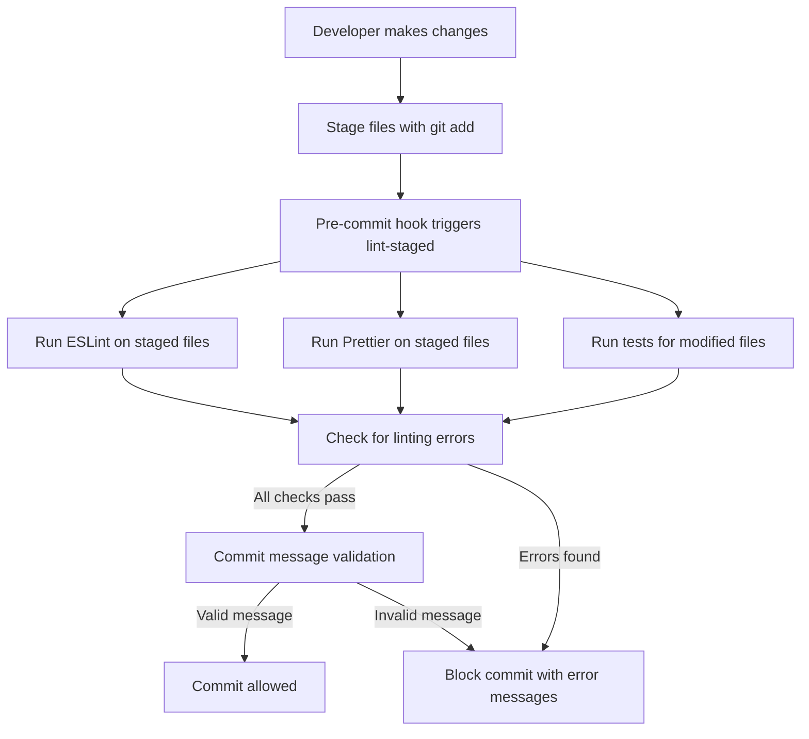

````markdown
# Git Workflow Enhancement Plan

## Overview

This plan outlines the implementation of a robust Git workflow using `lint-staged` and `conventional-commits` validation to enforce code quality and consistent commit messages.

## Current State Analysis

- Monorepo structure with pnpm workspaces
- Existing tools: ESLint, Prettier, Nx, Turbo, Conventional Changelog
- CI/CD: GitHub Actions
- Primary language: TypeScript

## Tools and Dependencies Required

### Core Packages

- `lint-staged`: Run linters on staged files
- `husky`: Git hooks management
- `@commitlint/cli`: Commit message validation
- `@commitlint/config-conventional`: Conventional Commits rules

### Development Dependencies

- `eslint`: JavaScript/TypeScript linting
- `prettier`: Code formatting
- `jest`: Testing framework (if not already present)
- `typescript`: TypeScript support

## Implementation Plan

### 1. Install Required Dependencies

```bash
pnpm add -D lint-staged husky @commitlint/cli @commitlint/config-conventional
```
````

### 2. Configure lint-staged

Create `.lintstagedrc.js` in project root:

```javascript
module.exports = {
  // TypeScript files
  "*.{ts,tsx}": filenames => [
    `eslint --fix ${filenames.join(" ")}`,
    `prettier --write ${filenames.join(" ")}`,
  ],

  // JavaScript files
  "*.{js,jsx}": filenames => [
    `eslint --fix ${filenames.join(" ")}`,
    `prettier --write ${filenames.join(" ")}`,
  ],

  // JSON and Markdown files
  "*.{json,md}": filenames => [`prettier --write ${filenames.join(" ")}`],

  // Run tests for modified files
  "*": filenames => ["jest --findRelatedTests --passWithNoTests"],
};
```

### 3. Configure commitlint

Create `commitlint.config.js` in project root:

```javascript
module.exports = {
  extends: ["@commitlint/config-conventional"],
  rules: {
    "type-enum": [
      2,
      "always",
      [
        "feat",
        "fix",
        "docs",
        "style",
        "refactor",
        "perf",
        "test",
        "chore",
        "revert",
      ],
    ],
    "subject-case": [2, "always", "sentence-case"],
  },
};
```

### 4. Set Up Husky Git Hooks

Add husky configuration to `package.json`:

```json
{
  "husky": {
    "hooks": {
      "pre-commit": "lint-staged",
      "commit-msg": "commitlint -E HUSKY_GIT_PARAMS"
    }
  }
}
```

Initialize husky:

```bash
pnpm exec husky install
pnpm exec husky add .husky/pre-commit "pnpm exec lint-staged"
pnpm exec husky add .husky/commit-msg "pnpm exec commitlint -E HUSKY_GIT_PARAMS"
```

### 5. Performance Optimization

- Parallelize tasks in lint-staged
- Cache dependencies using pnpm
- Use Nx/Turbo for build caching

### 6. CI/CD Integration

Update GitHub Actions workflow to include:

- Commit message validation
- Linting and formatting checks
- Test execution

### 7. Cross-Platform Compatibility

- Use shell-agnostic commands
- Test on Windows, macOS, and Linux
- Ensure consistent line endings

## Mermaid Diagram



## Configuration Examples

### ESLint Configuration

```javascript
// .eslintrc.js
module.exports = {
  root: true,
  parser: "@typescript-eslint/parser",
  plugins: ["@typescript-eslint"],
  extends: ["eslint:recommended", "plugin:@typescript-eslint/recommended"],
};
```

### Prettier Configuration

```json
// .prettierrc
{
  "semi": true,
  "singleQuote": true,
  "tabWidth": 2,
  "trailingComma": "es5",
  "printWidth": 100
}
```

### Jest Configuration

```javascript
// jest.config.js
module.exports = {
  preset: "ts-jest",
  testEnvironment: "node",
  testMatch: ["**/*.test.ts"],
};
```

## Error Handling

- Clear error messages for failed validations
- Color-coded output for better readability
- Suggestions for fixing common issues

## Customization

- Project-specific rules in commitlint config
- Custom lint-staged tasks per file type
- Adjustable severity levels

## Implementation Steps

1. Install dependencies
2. Create configuration files
3. Set up Git hooks
4. Test workflow locally
5. Update CI/CD pipeline
6. Document usage for team

## Success Criteria

- All commits follow Conventional Commits format
- Staged files pass linting and formatting
- Tests run successfully before commit
- Clear feedback for failed validations
- Cross-platform compatibility verified
