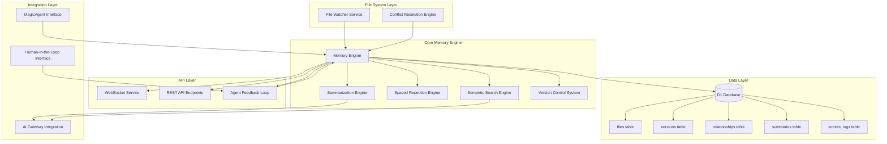

# Memory for Agents

## System Architecture Overview

### Core Components

1. **File Watcher Service**
   - Monitors .md files in designated directories
   - Detects real-time changes (create, update, delete)
   - Triggers synchronization events

2. **Conflict Resolution Engine**
   - Detects concurrent modifications
   - Implements merge strategies for conflicting changes
   - Maintains data integrity across distributed operations

3. **Memory Engine** (Central Coordinator)
   - Orchestrates all memory operations
   - Manages file indexing and metadata
   - Coordinates between all subsystems

4. **Summarization Engine**
   - Generates context-aware summaries using AI
   - Filters redundancy and preserves key insights
   - Updates summaries on content changes

5. **Spaced Repetition Engine**
   - Schedules memory reinforcement based on access patterns
   - Implements adaptive intervals for optimal retention
   - Tracks engagement metrics

6. **Semantic Search Engine**
   - Provides contextual retrieval of memory segments
   - Cross-references related files and concepts
   - Supports natural language queries

7. **Version Control System**
   - Maintains lightweight history of all changes
   - Enables selective restoration of previous states
   - Tracks authorship and timestamps

8. **Agent Feedback Loop**
   - Allows agents to flag inconsistencies
   - Supports human-in-the-loop validation
   - Enables structural improvement suggestions

### Data Model

- **files**: Core file metadata (path, hash, last_modified, status)
- **versions**: Change history with diffs and timestamps
- **relationships**: Links between related files and concepts
- **summaries**: AI-generated summaries with confidence scores
- **access_logs**: Usage patterns for spaced repetition

### Integration Points

- **AI Gateway**: Leverages existing Cloudflare AI Gateway for summarization and search
- **MagicAgent**: Primary consumer of memory services
- **Human Interface**: Admin panel for monitoring and manual interventions
- **WebSocket Streaming**: Real-time updates for connected clients
