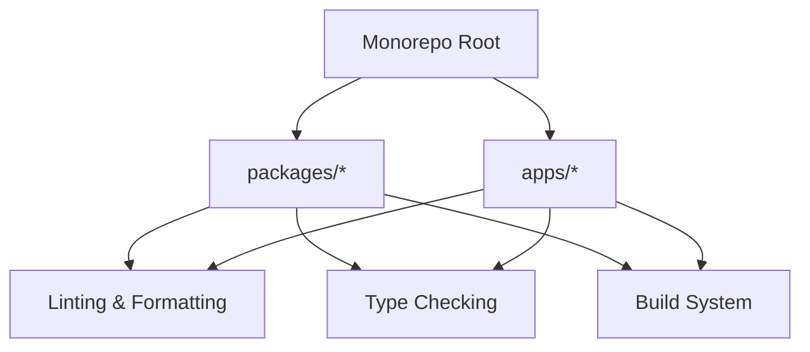

````markdown
# Monorepo Scripts Enhancement Plan

## Overview

This plan outlines the optimization of the root `package.json` and `turbo.json` files to enhance monorepo management, focusing on speed, correctness, developer experience (DX), and maintainability.

## Current State Analysis

- **Workspaces**: `packages/*` and `apps/*`
- **Existing Scripts**:
  - `build`: Uses `nx run-many` for all workspaces
  - `format`: Prettier for formatting
  - `format:check`: Prettier for checking formatting
  - `typecheck`: Uses `nx run-many` for type checking
  - `prepare`: Husky for Git hooks
- **Turbo Configuration**:
  - Tasks: `build`, `dev`, `format`, `lint`, `lint:fix`, `typecheck`
  - Dependencies and outputs defined for `build` task

## Proposed Enhancements

### 1. Linting & Formatting

- **Scripts**:
  - `lint`: Parallelized ESLint checks with caching
  - `lint:fix`: Auto-fix workflows
  - `format`: Prettier formatting with caching
  - `format:check`: Prettier checks with caching
- **Optimizations**:
  - Use `--since` for scoping to changed files
  - Support `--dry-run` and `--log-level` flags
  - Respect `.npmrc`/`turbo.json` cache configurations

### 2. Type Checking

- **Scripts**:
  - `typecheck`: Incremental `tsc --noEmit` with project references
  - `typecheck:strict`: Enforce strict mode
- **Optimizations**:
  - Parallelize across workspaces
  - Use Turbo’s `dependsOn` for dependency-aware execution

### 3. Build System

- **Scripts**:
  - `build`: Generic build script leveraging Turbo’s topological sorting
  - `build:package`: Per-package build scripts outputting to `dist/` with source maps and tree-shaking
  - `build:force`: Bypass caching with `--force` flag
- **Optimizations**:
  - Environment-aware builds (e.g., `NODE_ENV=production`)
  - Support `--dry-run` and `--log-level` flags

### 4. CI/CD Optimizations

- **Scripts**:
  - `prepublishOnly`: Pre-publish checks
  - `prepare`: Conditional hooks for local vs. CI environments
  - `postinstall`: Post-installation setup
- **Optimizations**:
  - Clear logs and progress bars
  - Fail-fast behavior

### 5. Workspace Tools

- **Scripts**:
  - `clean`: Remove `dist/` and `node_modules`
  - `reset`: Clean and reinstall dependencies
  - `sync`: Align versions and dependencies
- **Optimizations**:
  - Use Turbo’s `pipe` for task orchestration

### 6. Debugging

- **Scripts**:
  - `docs`: TypeDoc/TSDoc generation
  - `debug`: Inspector flags for debugging
- **Optimizations**:
  - Documented scripts with JSDoc in `package.json`

## Implementation Steps

1. Update `package.json` with new scripts and optimizations
2. Update `turbo.json` with task configurations and dependencies
3. Test scripts in local and CI environments
4. Document usage and flags in `package.json`

## Example Structure

```json
{
  "scripts": {
    "build": "turbo run build --parallel",
    "build:package": "tsc -p tsconfig.build.json && rollup -c",
    "lint": "turbo run lint --parallel --cache",
    "typecheck": "turbo run typecheck --parallel --continue"
  }
}
```
````

## Mermaid Diagram



## Next Steps

- Draft the updated `package.json` and `turbo.json` files
- Review and refine the plan with the user

```

```
