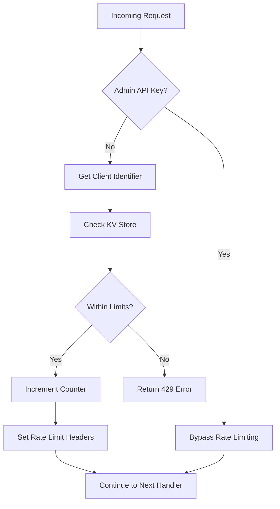

# Rate Limiting Implementation

## Overview

This document describes the rate limiting implementation for the MagicAppDev API, which provides protection against API abuse and ensures fair usage across all endpoints.

## Architecture

### Technology Stack

- **Framework**: Hono middleware for Cloudflare Workers
- **Storage**: Cloudflare KV for distributed rate limiting
- **Strategy**: Token bucket algorithm with sliding windows

### Components

1. **Rate Limit Middleware** ([`packages/api/src/middlewares/rate-limit.ts`](packages/api/src/middlewares/rate-limit.ts:1))
   - Core middleware implementation
   - Endpoint-based rate limiting
   - Client identification (user ID, API key, or IP)
   - Admin API key bypass

2. **Environment Configuration**
   - `RATE_LIMIT_KV`: Cloudflare KV namespace for rate limit storage
   - `ADMIN_API_KEYS`: Comma-separated list of admin API keys

## Rate Limiting Strategy

### Default Limits

| Endpoint Category | Requests | Window     | Description              |
| ----------------- | -------- | ---------- | ------------------------ |
| Default           | 100      | 60 seconds | General API endpoints    |
| Auth              | 10       | 60 seconds | Authentication endpoints |
| AI                | 20       | 60 seconds | AI/chat endpoints        |
| Projects          | 50       | 60 seconds | Project management       |
| Admin             | 30       | 60 seconds | Admin endpoints          |

### Client Identification

The rate limiting system identifies clients using the following priority order:

1. **Admin API Key**: Requests with valid admin API keys bypass rate limiting
2. **User ID**: Authenticated users are tracked by their user ID
3. **IP Address**: Unauthenticated requests are tracked by IP address

### Endpoint Categorization

Endpoints are automatically categorized based on their URL path:

- `/auth/*` → Auth limits
- `/ai/*` → AI limits
- `/projects/*` → Project limits
- `/admin/*` → Admin limits
- All other paths → Default limits

## Implementation Details

### Middleware Flow



### Response Headers

All rate-limited responses include the following headers:

- `X-RateLimit-Limit`: Maximum requests allowed in the window
- `X-RateLimit-Remaining`: Remaining requests in the current window
- `X-RateLimit-Reset`: Unix timestamp when the window resets

### Error Response

When rate limit is exceeded, the API returns:

```json
{
  "success": false,
  "error": {
    "code": "RATE_LIMIT_EXCEEDED",
    "message": "Too many requests. Please try again later."
  }
}
```

HTTP Status: `429 Too Many Requests`

## Configuration

### Environment Variables

Add the following to your Cloudflare Worker environment:

```bash
# Required for rate limiting to function
RATE_LIMIT_KV=your_kv_namespace_id

# Optional: Admin API keys (comma-separated)
ADMIN_API_KEYS=key1,key2,key3
```

### Customizing Limits

To customize rate limits for specific endpoints, modify the [`DEFAULT_LIMITS`](packages/api/src/middlewares/rate-limit.ts:14) object in [`rate-limit.ts`](packages/api/src/middlewares/rate-limit.ts:1):

```typescript
const DEFAULT_LIMITS: Record<string, RateLimitConfig> = {
  default: { requests: 100, window: 60 },
  custom: { requests: 50, window: 30 },
  // Add more categories as needed
};
```

Then update the [`getEndpointKey`](packages/api/src/middlewares/rate-limit.ts:22) function to map your endpoints.

## Deployment

### Cloudflare Setup

1. Create a KV namespace in Cloudflare:

   ```bash
   wrangler kv:namespace create RATE_LIMIT_KV
   ```

2. Add the namespace ID to your `wrangler.toml`:

   ```toml
   [[kv_namespaces]]
   binding = "RATE_LIMIT_KV"
   id = "your_namespace_id"
   ```

3. Deploy your worker:
   ```bash
   wrangler deploy
   ```

## Testing

### Manual Testing

1. Make multiple requests to a rate-limited endpoint:

   ```bash
   curl -H "Authorization: Bearer YOUR_TOKEN" https://api.example.com/projects
   ```

2. Check response headers:

   ```bash
   curl -I https://api.example.com/projects
   ```

3. Verify rate limit exceeded response:
   ```bash
   # After exceeding limits
   curl https://api.example.com/projects
   # Should return 429 status
   ```

### Admin API Key Testing

Test admin bypass functionality:

```bash
curl -H "X-API-Key: YOUR_ADMIN_KEY" https://api.example.com/admin/users
```

## Monitoring

### Logging

The middleware logs all rate limit checks:

- `[Rate Limit] Admin API key bypass` - Admin key used
- `[Rate Limit] Allowed request from {client} to {url} ({remaining}/{limit} remaining)` - Request allowed
- `[Rate Limit] Blocked request from {client} to {url}` - Request blocked

### Metrics

Monitor rate limiting effectiveness by tracking:

- Number of blocked requests per endpoint
- Rate of limit violations by client
- Peak usage times
- Admin API key usage

## Best Practices

1. **Choose Appropriate Limits**: Set limits based on endpoint resource usage
2. **Monitor Effectiveness**: Regularly review rate limit logs
3. **Adjust as Needed**: Update limits based on traffic patterns
4. **Communicate Limits**: Document rate limits in API documentation
5. **Handle Gracefully**: Clients should respect `Retry-After` headers

## Troubleshooting

### Rate Limiting Not Working

1. Verify KV namespace is configured
2. Check environment variables are set
3. Review worker logs for errors
4. Test with admin API key to verify bypass

### False Positives

If legitimate users are being blocked:

1. Increase limits for that endpoint
2. Consider implementing user-specific rate tiers
3. Review client identification logic

## Future Enhancements

- [ ] User-specific rate tiers
- [ ] Burst allowance for spiky traffic
- [ ] Rate limit analytics dashboard
- [ ] Configurable limits per API key
- [ ] Rate limit warnings before blocking
- [ ] Distributed rate limiting across edge locations

## References

- [Cloudflare KV Documentation](https://developers.cloudflare.com/kv/)
- [Hono Middleware Documentation](https://hono.dev/docs/middleware/)
- [HTTP 429 Status Code](https://developer.mozilla.org/en-US/docs/Web/HTTP/Status/429)
